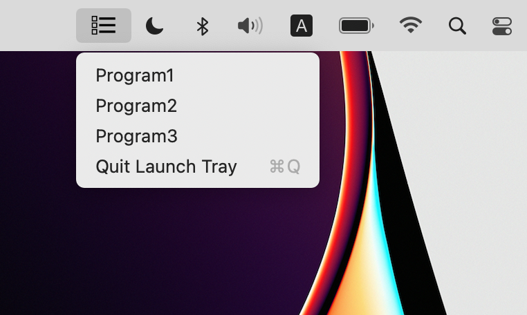

# launch-tray

Menu bar for Mac that launches the specified process in the background.



Prepare the following configuration file.

~/.launch-tray.json

```
{
    "shell": "/bin/zsh",
    "menus": [
        {
            "name": "Notify",
            "exec": "sleep 3; osascript -e 'display notification \"message\"'"
        },
        ...
    ]
}
```
